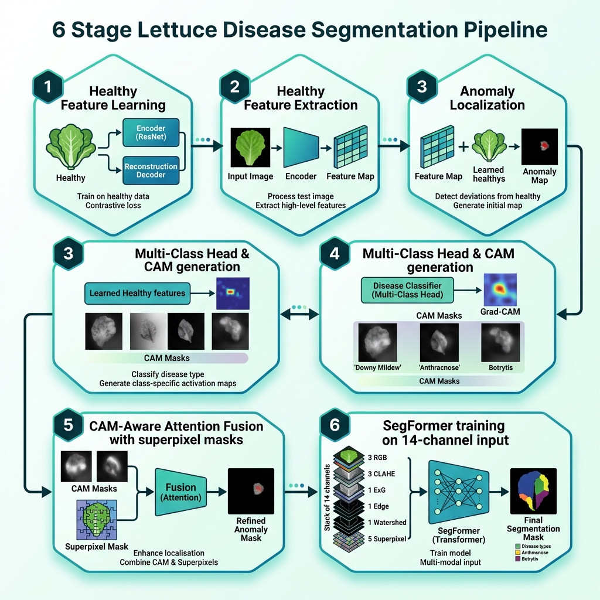

# Lettuce Disease Segmentation (Self‑Supervised Learning)



## 📚 Overview
This repository implements a **six‑stage, self‑supervised multi‑class lettuce disease segmentation pipeline**.  The core idea is to combine **structural anomaly cues** with **semantic class‑activation maps (CAMs)** and train a **SegFormer** model on a **14‑channel representation** of each image.

| Stage | Purpose | Key Outputs |
|------|---------|-------------|
| **1** | Healthy feature learning (DINOv2) | Frozen backbone, per‑pixel healthy statistics |
| **2** | Healthy feature extraction | Feature embeddings for every leaf (used later) |
| **3** | Unsupervised anomaly localization | Pixel‑wise anomaly maps (no labels needed) |
| **4** | Multi‑class head & CAM generation | Class‑specific CAMs for each disease |
| **5** | CAM‑aware attention fusion + superpixel snapping | **Pseudo‑masks** with 9 semantic classes (background + 8 disease/weeds) |
| **6** | SegFormer training on 14‑channel stack | Final segmentation model |

---

## 🏗️ Architecture & 14‑Channel Stack
The **SegFormer (MiT‑B3)** backbone has been adapted to accept **arbitrary input channels**.  The first patch‑embedding convolution is re‑initialized to match the number of channels.

**14 channels** stacked per image:
1. RGB (3) 
2. CLAHE‑enhanced RGB (3) 
3. Excess‑Green index (1) 
4. Canny edge map (1) 
5. Watershed segmentation (1) 
6. Felzenszwalb superpixel raw mask (1) 
7. Superpixel boundary mask (1) 
8. Superpixel colored visualization (3) 

The stack is created **offline** (Stage X) and stored as `*.npy` files under:
```
lettuce_ssl_segmentation_lab/stageX_precalculated_features/
```
During training the `MultiChannelLeafDataset` checks for these files and loads them directly, bypassing the heavy CPU preprocessing.

---

## 🖼️ Transforms & Masks
* **CLAHE** – local contrast enhancement using OpenCV (`apply_clahe`).
* **Excess‑Green (ExG)** – fast Numba‑jitted vegetation index (`fast_compute_exg`).
* **Edge map** – Sobel gradient magnitude.
* **Watershed** – region‑based segmentation (`apply_watershed`).
* **Superpixel** – Felzenszwalb algorithm, followed by a fast remap (`fast_remap_segments`).
* **Pseudo‑masks** – CAM‑aware attention fusion (Stage 5) that combines anomaly maps, CAMs and superpixel consensus.  Masks are stored as PNGs in `stage5_cam_attention_masks/masks/`.

---

## 🤖 Model & Loss Function
The training loop lives in `lettuce_ssl_segmentation_lab/pipeline/segmentation_trainer.py`.

* **Model** – `SegFormerForSemanticSegmentation` from 🤗 Transformers, dynamically reshaped for 14 input channels.
* **Optimizer** – AdamW with weight decay.
* **Losses** –
  * **Cross‑entropy** for pixel‑wise classification (9 classes).
  * **Dice loss** (optional, toggled via config) to improve boundary recall.
  * The total loss is `loss_ce + λ * loss_dice` (λ = 1.0 by default).
* **Metrics** – mean IoU, precision, recall logged to **MLflow** every epoch.
* **Early stopping** – patience = 15 epochs (configurable).  Checkpoints (`best_model.pth`) are saved after each improvement.

---

## 📂 Repository Layout
```
├─ lettuce_ssl_segmentation_lab/
│   ├─ config.py                     # global configuration
│   ├─ data/
│   │   └─ multichannel_dataset.py   # fast‑path dataset implementation
│   ├─ pipeline/
│   │   ├─ models.py                 # model factory, channel adaptation
│   │   ├─ segmentation_trainer.py   # training loop, resume logic
│   │   └─ metrics.py                # mIoU, precision, recall
│   └─ utils/
│       ├─ numba_ops.py              # ExG, remap implementations
│       └─ feature_extractor.py      # DINOv2 feature handling (Stage 1‑2)
├─ scripts/
│   ├─ stage1_healthy_learning.py
│   ├─ stage2_healthy_extraction.py
│   ├─ stage3_anomaly_localization.py
│   ├─ stage4_pseudo_mask_generation.py
│   ├─ stage5_cam_attention_masks.py
│   ├─ stage6_segmentation_training.py
│   └─ stageX_precalculate_features.py   # offline 14‑channel generation
└─ work.md                         # detailed pipeline description (already committed)
```

---

## 🚀 How to Run
```powershell
# Activate env (already done in repo)
conda activate gemma4

# Stage X – pre‑calculate 14‑channel tensors (run once)
python scripts\stageX_precalculate_features.py

# Train (Stage 6)
python scripts\stage6_segmentation_training.py   # uses resume logic automatically
```
All hyper‑parameters can be overridden via environment variables, e.g.:
```powershell
$env:BATCH_SIZE="64"
$env:NUM_EPOCHS="200"
python scripts\stage6_segmentation_training.py
```

---

## 📊 Validation Inference & Analytics (Stage 7)
After training, the pipeline integrates multiple diagnostic signals into a single validation output. This allows for cross-verification between structural anomalies and semantic predictions.

### How the SSL Pipeline Works:
1.  **Anomaly Scores (PaDiM)**: We model the healthy leaf patch distribution using DINOv2 features. Deviations from this "norm" are flagged as anomalies. This provides a **class-agnostic structural cue** for disease localization.
2.  **Class Probability Scores**: The trained SegFormer model produces pixel-wise confidence maps for each of the 8 disease classes. This provides **semantic classification** evidence.
3.  **Integrated Disease Maps**: By fusing the semantic SegFormer masks with the structural anomaly heatmaps, we achieve high-fidelity localization that is robust to both unseen patterns and complex backgrounds.

### Sample Inference Results
The following high-resolution (720 DPI) plots demonstrate the model's performance on the validation set. Each row shows:
- **Original RGB**: The source input.
- **Predicted Mask**: Semantic segmentation from SegFormer.
- **Class Probability**: Confidence map for the dominant disease.
- **Anomaly Map**: PaDiM-based structural deviation heatmap.


---

## 📌 References
* **DINOv2** – Self‑supervised vision transformer pre‑training.
* **SegFormer** – Efficient Transformer‑CNN hybrid for semantic segmentation.
* **MLflow** – Experiment tracking and artifact logging.
* **Felzenszwalb & Watershed** – Classical segmentation techniques used for structural cues.

---

*Created by Antigravity AI Assistant – © 2026*
